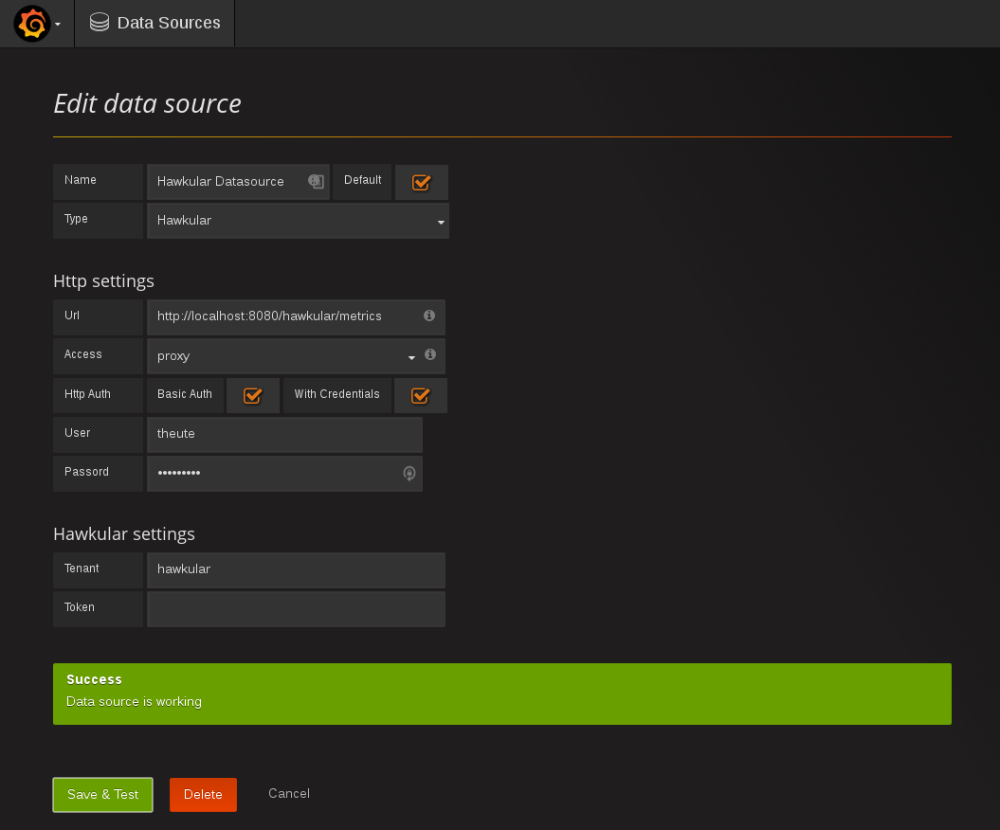

= Hawkular Datasource for Grafana
:source-language: javascript

This project is the Hawkular Datasource plugin for Grafana 3. It works with:

* http://www.hawkular.org[Hawkular Services]
* http://www.hawkular.org[Hawkular Metrics]

== Installing

=== From source

Download the source code and copy the content of `dist` to `hawkular` inside Grafana's plugin directory.

[source,bash]
----
# This is the default for Linux Grafana installs. Change it to match yours, if needed.
GRAFANA_PLUGINS=/var/lib/grafana/plugins
wget https://github.com/hawkular/hawkular-grafana-datasource/archive/master.zip -O hawkular-grafana-datasource-master.zip
unzip hawkular-grafana-datasource-master.zip
mkdir ${GRAFANA_PLUGINS}/hawkular
cp -R hawkular-grafana-datasource-master/dist/* ${GRAFANA_PLUGINS}/hawkular
----

=== From the Grafana plugin directory

COMING SOON

== Configuration

The datasource URL must point to the Hawkular Metrics service, e.g. `http://localhost:8080/hawkular/metrics`

`direct` access mode only works with standalone Metrics servers currently. If you active it, make sure to allow
the Grafana server origin in Metrics' configuration.

Authentication must be set when working with a Hawkular server. Check the 'Basic Auth' box and fill the user and password fields.

Select the tenant. On Hawkular servers, use `hawkular`.

Openshift-Metrics users must provide an authentication token.

== Building

You need `npm` and `grunt` to build the project.
